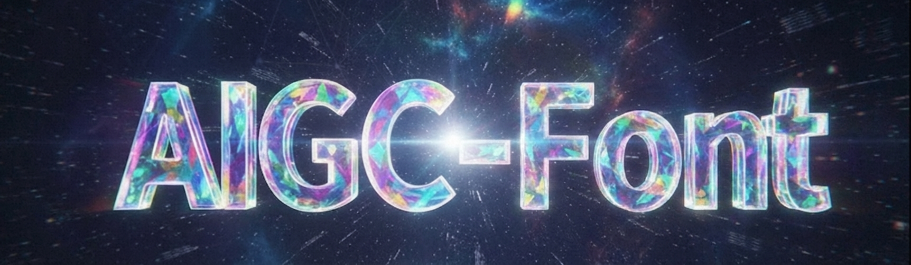

# Awesome-Font-AIGC 🎨

> This repository catalogs cutting-edge research papers, practical tools, datasets, and learning materials for AI-powered Font image generation, processing, and manipulation.

## 📋 Table of Contents

- [📚 Papers](#-papers)
- [🛠️ Tools](#️-tools)
- [🚀 Open Source Projects](#-open-source-projects)

---

## 📚 Papers

> All papers are in chronological order, from newest to oldest

1. UTDesign: A Unified Framework for Stylized Text Editing and Generation in Graphic Design Images, 2025-12-15, [paper](http://arxiv.org/abs/2512.20479)
2. TextDiffuser-RL: Efficient and Robust Text Layout Optimization for High-Fidelity Text-to-Image Synthesis, 2025-11-09, [paper](http://arxiv.org/abs/2505.19291)
3. TextCrafter: Accurately Rendering Multiple Texts in Complex Visual Scenes, 2025-08-18, [paper](http://arxiv.org/abs/2503.23461)
4. FonTS: Text Rendering with Typography and Style Controls, 2025-07-11, [paper](http://arxiv.org/abs/2412.00136)
5. Calligrapher: Freestyle Text Image Customization, 2025-06-30, [paper](http://arxiv.org/abs/2506.24123)
6. GlyphMastero: A Glyph Encoder for High-Fidelity Scene Text Editing, 2025-05-08, [paper](http://arxiv.org/abs/2505.04915)
7. AnyText2: Visual Text Generation and Editing With Customizable Attributes, 2024-11-22, [paper](https://arxiv.org/abs/2411.15245)
8. DiffusionPen: Towards Controlling the Style of Handwritten Text Generation, 2024-09-09, [paper](http://arxiv.org/abs/2409.06065)
9. Kinetic Typography Diffusion Model, 2024-07-15, [paper](http://arxiv.org/abs/2407.10476)
10. Glyph-ByT5-v2: A Strong Aesthetic Baseline for Accurate Multilingual Visual Text Rendering, 2024-06-14, [paper](https://arxiv.org/abs/2406.10208v2)
11. AnyText: Multilingual Visual Text Generation And Editing, 2024-02-21, [paper](https://arxiv.org/abs/2311.03054)
12. TextDiffuser-2: Unleashing the Power of Language Models for Text Rendering, 2023-11-28, [paper](http://arxiv.org/abs/2311.16465)
13. DiffUTE: Universal Text Editing Diffusion Model, 2023-10-18, [paper](http://arxiv.org/abs/2305.10825)
14. STRIVE: Scene Text Replacement In Videos, 2021-09-06, [paper](http://arxiv.org/abs/2109.02762)

---

## 🛠️ Tools

### Code Libraries
- **[HunyuanOCR](https://github.com/Tencent-Hunyuan/HunyuanOCR)** - A precise tool for character content recognition and position bounding.

- **[RMBG](https://huggingface.co/briaai/RMBG-2.0)** - A convenient model for foreground-background separation.

<!-- ### Online 
- **[SVG Viewer](https://www.svgviewer.dev/)** - Web-based SVG editor and viewer -->
 
---

## 🚀 Open Source Projects
- **[AnyText](https://github.com/tyxsspa/AnyText)** - A diffusion-based framework capable of rendering legible and coherent text in multiple languages (especially Chinese and English). It features an auxiliary latent module that integrates text glyph information, enabling high-quality text-to-image generation and scene text editing within specified regions.

- **[AnyText2](https://github.com/tyxsspa/AnyText2)** - A diffusion-based framework designed for rendering accurate and coherent text within images. This tool allows for multilingual text generation and precise text editing (replacing/modifying text in existing images) while offering fine-grained control over text attributes like layout, curvature, and font style, significantly outperforming its predecessor in visual quality and spelling accuracy.

---

## 🤝 Contributing

Contributions are welcome! If you know of any great resources related to AIGC-Font that should be included, please feel free to share them.

### How to Contribute

Simply **open an issue** with the following information:

- **Resource Name**: The name of the tool/paper/dataset/etc.
- **Category**: Which section it belongs to (Papers, Tools, Datasets, etc.)
- **Link**: URL to the resource
- **Description**: Brief description of what it is and why it's useful
- **Tags** (optional): Year, conference, keywords, etc.

---

## 📄 License

This project is licensed under the MIT License - see the [LICENSE](LICENSE) file for details.

---

**⭐ Star this repository if you found it helpful!**

